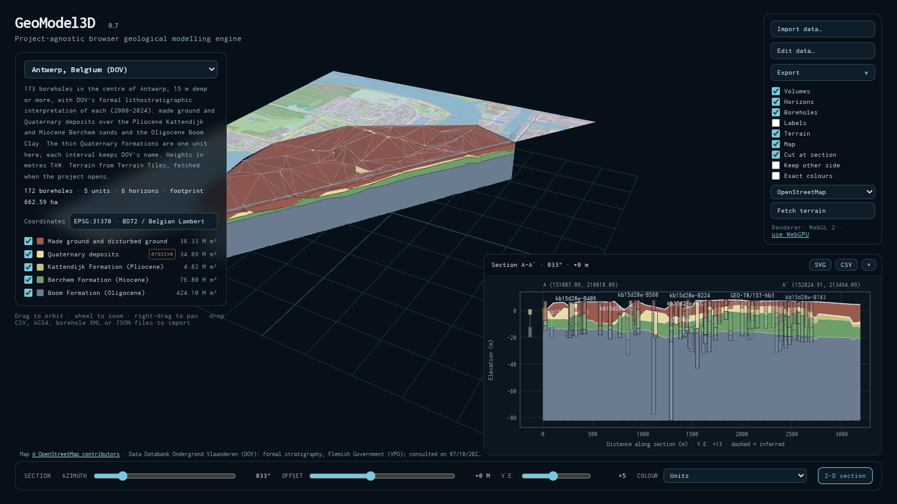
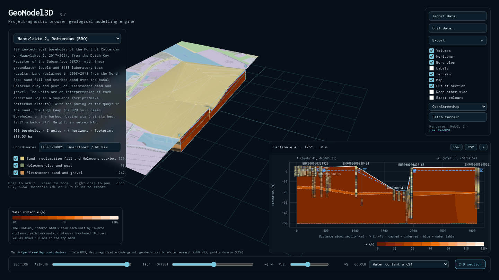
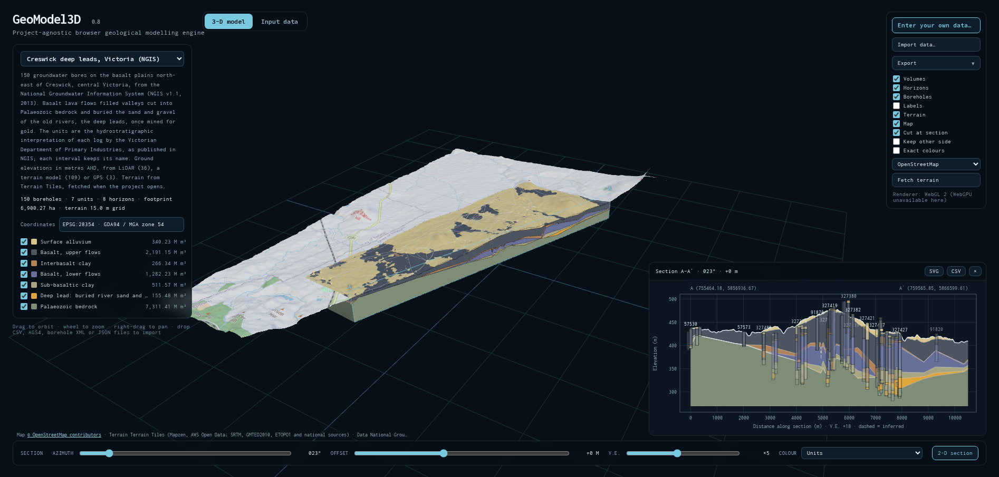
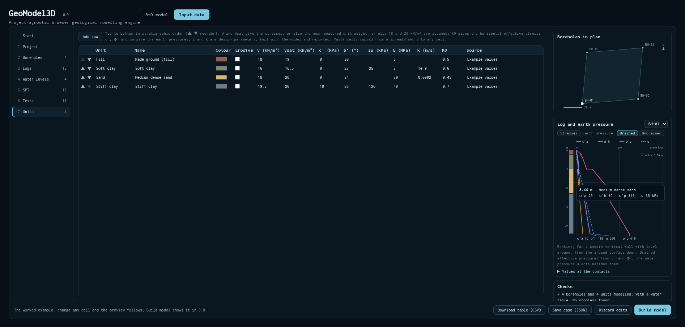
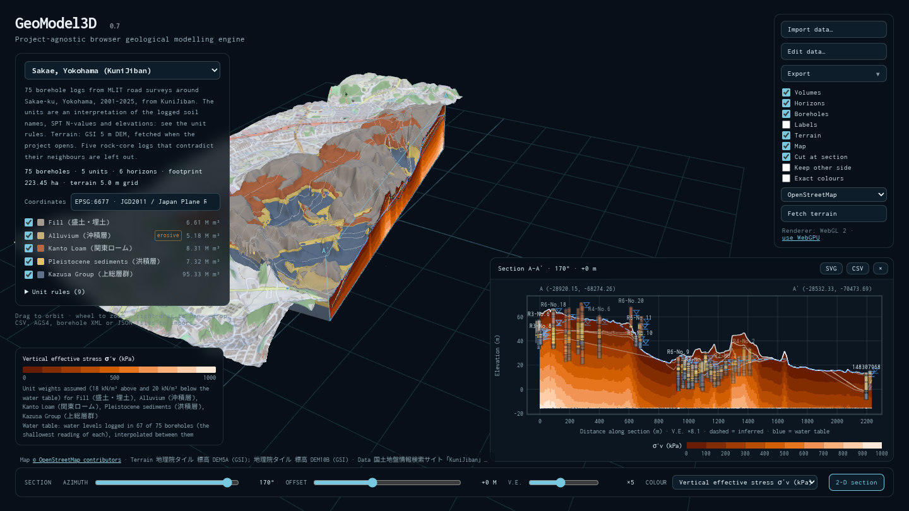
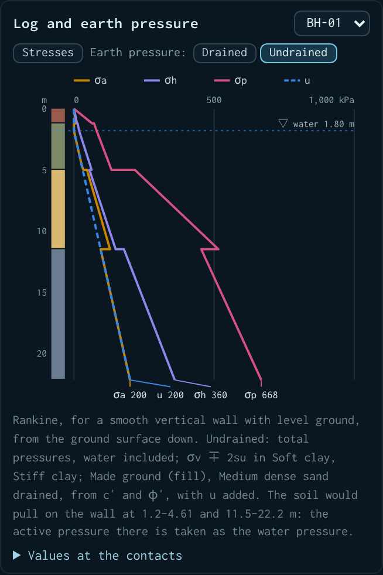

# GeoModel3D: 3D geological models from borehole logs, in the browser

[](https://kilickursat.github.io/GeoModel3D/)
[](https://github.com/kilickursat/GeoModel3D/actions/workflows/build.yml)
[](LICENSE)
[](https://threejs.org)

**Open-source 3D geological and geotechnical modelling for engineers, engineering geologists and hydrogeologists.** GeoModel3D turns borehole logs into a 3D stratigraphic model: TIN horizons, closed unit volumes and cross-sections at any angle. It places the model on a real map in the site's national coordinate system. On any section it shows the groundwater, the vertical total and effective stresses, the horizontal effective stress where K0 is given, and laboratory or in-situ test results. Down any borehole of your own case, it gives the active, at-rest and passive earth pressures on a wall, drained or undrained.

Data can come from:
- CSV, AGS4, Japanese, Dutch (BRO) and Flemish (DOV) borehole files;
- the **Input data** tab, where your own case is typed in or pasted from a spreadsheet (boreholes, logs, groundwater, field and laboratory tests, unit weights and design values) and built into a model. One borehole is enough.

Reports are exported as PDF. It runs entirely in the browser, with nothing to install and nothing uploaded. It uses WebGPU, falling back to WebGL 2, and also works offline from a single HTML file.

- **Live:** https://kilickursat.github.io/GeoModel3D/
- **Offline:** [geomodel3d-offline.html](https://kilickursat.github.io/GeoModel3D/geomodel3d-offline.html) is one self-contained file that opens from disk, for networks where hosted pages or local servers are not an option.


## Real sites in four countries

Each site is published data, in its country's own coordinate system and height datum, with its source credited and its licence checked:

| Site | Data | Coordinates and heights | Shows |
|---|---|---|---|
| **Sakae, Yokohama, Japan** | 75 borehole logs from MLIT road surveys (KuniJiban) | JGD2011 / Japan Plane Rectangular CS IX (EPSG:6677), T.P. | Fill, alluvium, Kanto Loam and Pleistocene sediments over the Kazusa Group, interpreted from soil names, SPT N-values and elevations; GSI 5 m terrain |
| **Antwerp, Belgium** | 173 boreholes with the formal lithostratigraphy of DOV, the Flemish subsurface database | Belgian Lambert 72 (EPSG:31370), TAW | Made ground and Quaternary deposits over the Kattendijk and Berchem sands and the Boom Clay |
| **Maasvlakte 2, Rotterdam, Netherlands** | 100 geotechnical boreholes from the Dutch Key Register of the Subsurface (BRO), with 3,188 laboratory results and 56 groundwater levels | RD New (EPSG:28992), NAP | Reclaimed land on Holocene clay and peat over Pleistocene sand and gravel, the harbour basins, and water content, unit weight, Atterberg limits, fines and undrained shear strength |
| **Creswick deep leads, Victoria, Australia** | 150 groundwater bores with the hydrostratigraphic interpretation of the Victorian Department of Primary Industries, from the National Groundwater Information System (NGIS) | GDA94 / MGA zone 54 (EPSG:28354), AHD | Basalt lava flows that filled valleys cut into Palaeozoic bedrock and buried the sand and gravel of the old rivers, the deep leads |

| Antwerp: formations along the Scheldt | Maasvlakte 2: water content in the section |
|---|---|
|  |  |
| **Creswick: basalt over the deep leads** | **Input data: a case typed in by hand** |
|  |  |

## Version 0.9

- **Earth pressures** on a wall down any borehole in the Input data tab: active, at rest and passive (Rankine), drained from c′ and φ′ or undrained from su, with the depths where the soil would pull on the wall. See [Earth pressures](#earth-pressures).
- **Contributing:** a [contribution guide](CONTRIBUTING.md) with the rules for adding data, issue templates, and a [Sponsoring](#sponsoring) section (0.8.1).
- **Fewer notes on coarse terrain:** collars that scatter about a coarse terrain grid are summed up in one note, and only those that stand out are listed (0.8.1).

Earlier versions:
- **0.8:** the Input data tab, where your own case is entered and modelled, from one borehole up; σ′h = K0 · σ′v; the Creswick deep leads in Australia; pinch-outs at the borehole that lacks the unit, now the documented rule.
- **0.7:** real sites in Belgium and the Netherlands; groundwater, σv, u and σ′v on sections; laboratory and in-situ tests; Dutch BRO and Flemish DOV files; a data editor; descriptions grouped by principal soil in seven languages; the RD New and Luxembourg 170 m datum fix.
- **0.6:** coordinate systems for 40 countries, fetched terrain and maps, Japanese borehole XML, unit rules, the Sakae site, adaptive refinement, PDF reports.
- **0.5:** terrain grids, erosional units, unit weights, WebGPU rendering.
- **0.4:** heterogeneous logs and pinch-outs; CSV, AGS4 and JSON import; sections at any orientation with export.

See [CHANGELOG.md](CHANGELOG.md).

## Preparing your data

Use **Import data…** or drop files on the page. Files are read in the browser and are not uploaded anywhere.

### Which format

| You have | Import |
|---|---|
| A spreadsheet of boreholes | CSV tables (below): one combined table, or separate collar, log, unit, test, SPT and water-level tables imported together. Start from the [templates](docs/templates). |
| An AGS4 file (UK, Ireland, Hong Kong, Singapore, Australia, New Zealand…) | The `.ags` file. |
| Japanese electronic-delivery borehole logs (電子納品, KuniJiban) | All of a project's `.xml` logs at once. |
| Dutch BRO geotechnical boreholes (BHR-GT) | The IMBRO `.xml` from BROloket or the BRO web service, all at once. |
| Flemish DOV boreholes | The XML of each borehole (`dov.vlaanderen.be/data/boring/…`) together with the XML of its interpretations (`…/data/interpretatie/…`). |
| A project saved from GeoModel3D, or a Georeport3D extraction | The `.json` file. |
| Terrain | An ESRI ASCII grid (`.asc`) or gridded `x y z` points (`.xyz`), with the boreholes or on its own. |
| Nothing in a file yet | The **Input data** tab ([Entering your own data](#entering-your-own-data)). |

### CSV tables

Each table is a CSV file with a header row. Headers are matched by name: case, spaces, punctuation and a unit in brackets do not matter, so `Depth From (m)` reads as `from`. Comma, semicolon and tab delimiters are detected, and decimal commas are accepted in semicolon files. Files are read as UTF-8 or Shift_JIS. The kind of table is recognised from its columns. Ready-to-fill examples are in [docs/templates](docs/templates):

| Template | Table | Columns (accepted names) |
|---|---|---|
| [boreholes.csv](docs/templates/boreholes.csv) | **Collars**, one row per borehole | **hole id** (`hole_id`, `Hole ID`, `BH`, `LOCA_ID`, `Name`); **x** (`x`, `Easting`, `E`) and **y** (`y`, `Northing`, `N`), *or* **latitude** and **longitude** (`lat`, `lon`); **ground level** (`z`, `Elevation`, `RL`, `Ground level`); optional **final depth** (`depth`, `Final depth`, `EOH`); optional **water depth** (`water_depth`, `Water level`, `GWL`) |
| [logs.csv](docs/templates/logs.csv) | **Logs**, one row per interval | **hole id**; **from** and **to** (`from`/`to`, `Depth From`/`Depth To`, `Top`/`Base`), in metres below the collar; **unit** (`unit`, `Formation`, `Lithology`, `Stratum`, `GEOL_GEOL`) and/or **description** (`description`, `GEOL_DESC`) |
| [units.csv](docs/templates/units.csv) | **Units**, top to bottom in stratigraphic order | **unit**; optional `name`, `colour` (`#rrggbb`), `erosive` (yes/no), unit weight `gamma` and saturated unit weight `gamma_sat` (kN/m³), design values `c` (kPa), `phi` (°), `su` (kPa), `E` (MPa), `k` (m/s), `K0` or any property of the catalogue below, and `source` |
| [water.csv](docs/templates/water.csv) | **Water levels** | **hole id**; **water depth** below the collar (m); optional `date` |
| [spt.csv](docs/templates/spt.csv) | **SPT tests** | **hole id**; **depth** (m); `N`, or `blows` and `penetration` (mm, 300 for a complete test) |
| [tests.csv](docs/templates/tests.csv) | **Test results**, long form: one value per row | **hole id**; **depth** (m), optional **to** for a sample over a depth range; **property** (key, name or symbol of the catalogue below, or any other name); **value**; optional `unit` |
| [tests-wide.csv](docs/templates/tests-wide.csv) | **Test results**, wide form: one sample per row | **hole id**; **depth**; one column per property, such as `w (%)`, `bulk density (Mg/m3)`, `LL`, `PL`, `su (kPa)` |
| [boreholes-combined.csv](docs/templates/boreholes-combined.csv) | **One combined table** | The collar columns and the log columns on every row |

How these tables are read:
- **Coordinates:**
  - x and y are eastings and northings in metres in one projected coordinate system.
  - Latitude and longitude (WGS 84, or a national realisation within a metre or two of it: JGD2011, ETRS89, GDA2020, NAD83) are converted to the project's system, or to the one suggested for the site.
- **Units:** a unit not in the units table is added at the bottom of the column. Without a units table, the order is inferred from the logs (a unit directly above another in any hole is younger).
- **Descriptions without units:** intervals that carry only descriptions are grouped by principal soil or rock: Made ground, Peat, Clay, Silt, Sand, Gravel and rock types. These [unit rules](#how-a-model-is-built) can then be edited.
- **Converted values:**
  - a density column becomes a unit weight (× 9.81);
  - strengths and moduli given in the other of kPa and MPa (or GPa) are converted;
  - values outside a property's plausible range are reported.

**Property catalogue.** Test results and unit design values use these keys; the names and symbols are also understood.

| Key | Property | Unit | | Key | Property | Unit |
|---|---|---|---|---|---|---|
| `N` | SPT N-value | blows/300 mm | | `su` | Undrained shear strength | kPa |
| `w` | Water content | % | | `qu` | Unconfined compressive strength | kPa |
| `gamma` | Bulk unit weight | kN/m³ | | `ucs` | Uniaxial compressive strength (rock) | MPa |
| `gammaDry` | Dry unit weight | kN/m³ | | `c` | Effective cohesion c′ | kPa |
| `LL` | Liquid limit | % | | `phi` | Effective friction angle φ′ | ° |
| `PL` | Plastic limit | % | | `E` | Young's modulus | MPa |
| `PI` | Plasticity index | % | | `k` | Hydraulic conductivity | m/s |
| `fines` | Fines content (< 63 or 75 µm) | % | | `qc` | Cone resistance | MPa |
| `organic` | Organic content | % | | `Vs` | Shear-wave velocity | m/s |
| `RQD` | Rock quality designation | % | | `K0` | Earth pressure coefficient at rest (gives σ′h) | – |

### AGS4

| Group | What is read |
|---|---|
| `LOCA` | `LOCA_NATE`/`LOCA_NATN`, or `LOCA_LAT`/`LOCA_LON`, with the local grid as a fallback; ground level `LOCA_GL`; final depth `LOCA_FDEP`. A recognised `LOCA_GREF` (such as `OSGB`, `ITM`, `HK1980`, `SVY21`, `NZTM` or `EPSG:27700`) sets the coordinate system. |
| `GEOL` | `GEOL_TOP`/`GEOL_BASE`, the unit from `GEOL_GEOL`, `GEOL_GEO2` or `GEOL_LEG` (named from `ABBR`), and the description `GEOL_DESC`, which gives the units when there are no codes |
| `ISPT` | SPT N-values (`ISPT_TOP`, `ISPT_NVAL`) |
| `WSTG`, `WSTD` | Water strikes, and the level they rose to (`WSTD_POST`) |
| `LNMC`, `LDEN`, `LLPL`, `GRAG` | Water content; bulk and dry density (as unit weights); liquid and plastic limits and plasticity index; fines |
| `TRIT`, `LVAN`, `LPEN`, `IVAN` | Undrained shear strength from triaxial, laboratory vane, hand penetrometer and in-situ vane tests |
| `TREG`, `SHBG` | Effective cohesion and friction angle from triaxial and shear box tests |
| `RUCS`, `PTST` | Rock uniaxial compressive strength and Young's modulus; permeability |

Laboratory results are placed at the specimen depth (`SPEC_DPTH`) or the top of the sample (`SAMP_TOP`).

### Japanese borehole XML

These are logs in the electronic-delivery format (地質・土質調査成果電子納品要領, versions 2 to 4), as delivered with Japanese public-works site investigations and served by [KuniJiban](https://www.kunijiban.pwri.go.jp). What is read:
- the position and geodetic datum (the Tokyo datum is shifted to JGD2011);
- the collar elevation;
- soil and rock descriptions;
- SPT tests;
- water levels.

Units come from the current project's unit rules or, for a new project, from a grouping of the soil names by principal material.

### Dutch BRO geotechnical boreholes (BHR-GT)

These are IMBRO XML files from the Key Register of the Subsurface ([BROloket](https://www.broloket.nl), or `publiek.broservices.nl/sr/bhrgt/v2/objects/<BRO-ID>`). What is read:
- the RD New position;
- the level in NAP, and whether it is the ground or a water bottom;
- the field description of the layers;
- the groundwater level;
- the laboratory determinations: water content, density (as unit weight), organic content, fines, Atterberg limits and undrained shear strength.

Soil names are written English first, principal soil leading, with the Dutch kept: `zwakSiltigZandMetGrind` becomes "Sand, slightly silty, with gravel (zwak siltig zand met grind)".

### Flemish DOV boreholes

DOV serves the XML of a borehole (`dov.vlaanderen.be/data/boring/<key>.xml`) and of its interpretations (`…/data/interpretatie/<key>.xml`). Import both together; they are joined by the borehole's identifier.

The most geological interpretation present is used for every borehole, the latest where there are several. In order of preference:
1. formal stratigraphy;
2. Quaternary or informal stratigraphy;
3. lithological description (Dutch or French);
4. geotechnical coding.

Formal stratigraphy is modelled by formation, named in English from DOV's code list, with the members kept in the descriptions. Positions are in Belgian Lambert 72, heights in metres TAW.

### Project JSON

**Export → Project (JSON)** writes everything the viewer knows, and it imports back unchanged:

```json
{
  "format": "geomodel3d-project",
  "version": 1,
  "name": "My site",
  "source": "Site investigation report 2024-17",
  "crs": "WGS 84 / UTM zone 54N",
  "crsCode": "EPSG:32654",
  "groundwaterDepth": 2.0,
  "units": [
    {"id": "MG", "name": "Made ground", "color": "#9a5b4f", "gamma": 19, "source": "Site investigation report, table 4"},
    {"id": "CG", "name": "Channel gravel", "color": "#d08a4c", "erosive": true},
    {"id": "MS", "name": "Mudstone", "color": "#6f7686", "gamma": 23, "gammaSat": 23.5, "params": {"c": 25, "phi": 32, "E": 400}}
  ],
  "boreholes": [
    {"id": "BH-01", "x": 456732.2, "y": 3987210.6, "z": 124.6, "depth": 35,
     "intervals": [{"from": 0, "to": 3.2, "unit": "MG", "name": "Made ground: sandy gravel"}, {"from": 3.2, "to": 30, "unit": "MS"}],
     "water": [{"depth": 2.4, "date": "2024-03-12"}],
     "spt": [{"depth": 5, "blows": 12, "penetration": 300}, {"depth": 8, "blows": 50, "penetration": 120}],
     "tests": [{"depth": 2.5, "to": 2.9, "property": "w", "value": 31.5}, {"depth": 6.0, "property": "ucs", "value": 4.2}]}
  ],
  "terrain": {"x0": 456725, "y0": 3987205, "dx": 5, "dy": 5, "ncols": 3, "nrows": 2,
              "z": [124.1, 124.3, 124.8, 123.9, null, 124.5]}
}
```

Fields of the project file:
- **Depths and values:** depths are in metres below the collar. Unit weights are in kN/m³. `params` holds unit design values by catalogue key.
- **Groundwater:** `groundwaterDepth` is an assumed water-table depth, used where no borehole has a water level.
- **Model base:** `base` (optional) is the elevation of a flat model base.
- **Model extent:** `margin` (optional, metres) extends the model beyond its outermost boreholes.
- **Terrain:** cells run west to east from the south-west cell centre (`x0`, `y0`); `null` marks a cell without data.
- **Coordinate system:** `crsCode` georeferences the project with a code from the registry. A system not in the registry can be given as a PROJ definition in `crsProj4`.
- **Projects built from descriptions** also keep `rules` (`match`, `unit`, and optionally `minN`, `maxN`, `minZ`, `maxZ`), and each interval's logged description as `name`.
- **Georeport3D extractions:** `collar` easting/northing/elevation, `total_depth`, and `intervals` (`depth_from`, `depth_to`, `lithology`). A borehole without a complete collar is reported and not placed; coordinates are never invented.

**Export** also writes:
- **Boreholes (CSV)**, with descriptions and water depths;
- **Tests (CSV)**;
- **Section (SVG and CSV)**;
- **Section field (CSV)**: the stress or property shown, on a grid over the section;
- **Report (PDF, A3 or A4)**.

## Entering your own data

The **Input data** tab, next to **3-D model** at the top of the page, is where you enter your own case and model it. Open it there, with **Enter your own data…** in the toolbar or the dataset list, or directly at [kilickursat.github.io/GeoModel3D/#input](https://kilickursat.github.io/GeoModel3D/#input).

**Start** offers:
- **New case:** empty tables to fill in;
- **Worked example:** four boreholes with water levels, SPT, laboratory tests and unit parameters, to see the format and change it;
- **Edit the dataset shown:** the tables of the model on screen, to change or add to;
- **Import files…:** CSV, AGS4, borehole XML or project JSON, opened here for review before building;
- **Continue the saved case:** what you typed before, if this browser kept it.

Then fill in the steps:

| Step | Holds |
|---|---|
| Project | Name, description, data source, coordinate system (EPSG code, name or PROJ definition; empty or any other name for a local grid), assumed groundwater depth, model base, model extent beyond the boreholes |
| Boreholes | Borehole, easting and northing *or* latitude and longitude, ground level, final depth |
| Logs | Borehole, from, to, unit, description. **Fill units from descriptions** applies the project's unit rules, or the grouping by principal soil |
| Water levels | Borehole, depth to water, date |
| SPT | Borehole, depth, blows, penetration |
| Tests | Borehole, depth, to, property, value: any laboratory or in-situ result |
| Units | Unit, name, colour, erosive, γ, γsat, c′, φ′, su, E, k, K0, source, in stratigraphic order (▲ ▼ to reorder) |

While you type, the preview shows:
- **the boreholes in plan**, with the outline of the model; click a borehole to show it;
- **the log of one borehole** as the model has it, with the vertical total stress σv, the pore pressure u, the vertical effective stress σ′v and, where K0 is given, the horizontal effective stress σ′h down it. Hover for the values at any depth; **Values at the contacts** lists them at the top and base of each unit. **Earth pressure: Drained** or **Undrained** shows instead the active, at-rest and passive earth pressures on a wall down it (see [Earth pressures](#earth-pressures));
- **the checks** of the importer and the model: rows that cannot be used, values outside plausible ranges, units out of order.

**Build model** turns the tables into the model through the same importer as CSV files, and shows it in 3-D, where sections can be coloured by stresses or measured properties and a PDF report can be printed.

Good to know:
- **One borehole is enough.** A single borehole needs neither a position nor a ground level (0, 0 and 0 m are used, and said so). One or two boreholes, or boreholes in a line, are modelled over an extent around them; set **Model extent beyond the boreholes** to choose it, or to extend any model beyond its outermost boreholes.
- **Unit weights** give the stresses: γ above the water table and γsat below it. A unit without them takes the mean measured unit weight, or else 18 and 20 kN/m³, which the preview and the report say. **K0** gives σ′h, and **c′, φ′ and su** the earth pressures. E and k are design parameters, kept with the model and listed in the report.
- **Pasting:** cells copied from a spreadsheet paste into any table, starting at the cell pasted into, and add rows as needed. Large tables are shown one borehole at a time.
- **Nothing is uploaded.** What you type is kept in this browser, so a reload does not lose it, until you type in another case. **Save case (JSON)** keeps a copy you can import again, and **Download table (CSV)** saves a table as CSV.

## Groundwater, stresses and measured properties

The **Colour** selector on the section bar colours the 3-D section face and the 2-D section by one of:
- **Units** (the default);
- **vertical total stress σv**, **pore water pressure u**, **vertical effective stress σ′v**, or, where the units are given a K0, **horizontal effective stress σ′h**;
- **any measured property**.

Colours are bands of one hue, with a legend that states what the field rests on.

How the fields are computed:
- **Water table:** it runs through the shallowest water level logged in each borehole, interpolated between boreholes and kept at or below the ground. Where no borehole has a water level, the project's assumed groundwater depth is used. It is drawn blue on sections, with ▽ at the logged levels.
- **Stresses:**
  - σv sums unit weight × thickness from the ground down, using γ above the water table and γsat below it.
  - u is hydrostatic below the water table, and σ′v = σv − u.
  - σ′h = K0 · σ′v with each unit's own K0; units without a K0 are left uncoloured, and the legend names them.
  - Unit weights are, in order of preference: the unit's own values; the mean measured bulk unit weight in the unit; or an assumed 18 and 20 kN/m³. Assumed values are reported, because they suit few soils: peat or volcanic ash are much lighter, rock heavier.
  - Where the water table is at the ground, as under open water, stresses are counted from the ground.
- **Measured properties** (SPT N, water content, su…):
  - they are interpolated within each unit only, by inverse distance with horizontal distances shortened ten times, since properties vary much more with depth than across a site;
  - units where a property was not measured stay grey;
  - SPT N-values are coloured up to 50, the usual refusal.
- **Read-outs:** hovering over the section face (3-D) or the 2-D section shows the unit, the depth, σv, u and σ′v (and σ′h where K0 is given), and the field's value.



The report's ground-parameters table lists:
- the unit weights used and where they come from;
- the units' design values;
- the mean, range and number of every measured property per unit.

## Earth pressures

In the **Input data** tab, **Earth pressure: Drained** or **Undrained** turns the profile of the borehole shown into the pressures on a wall down that borehole, by Rankine's theory, for a smooth vertical wall with level ground behind it:

| | Drained (long term) | Undrained (short term) |
|---|---|---|
| Pressures | effective, from c′ and φ′; the water pressure u acts besides them | total, water included |
| Active | σ′a = Ka · σ′v − 2c′√Ka | σa = σv − 2su |
| Passive | σ′p = Kp · σ′v + 2c′√Kp | σp = σv + 2su |
| At rest | σ′h = K0 · σ′v | σh = K0 · σ′v + u |

Here Ka = tan²(45° − φ′/2) and Kp = tan²(45° + φ′/2) = 1/Ka. Undrained, the formulas with su apply to the units given an su; the other units drain, and take their drained pressures plus u.

- **Missing values:** a unit without φ′ (drained), or without su and φ′ (undrained), has no active or passive pressure, and the at-rest pressure needs K0. A c′ that is not given is taken as 0. The notes under the chart name the units concerned.
- **Tension cracks:** where the soil would pull on the wall, the effective active pressure is taken as zero: the drained pressure is 0, and the undrained total pressure equals the water pressure. The notes give the depths.
- **Not included:** wall friction, sloping ground, surcharges and an excavation level. All pressures run from the ground surface down, so the passive pressure in front of an excavation, which starts at its floor, is not shown as such. su is one value per unit.
- **Values:** hover over the chart for the values at any depth; **Values at the contacts** lists them at the top and base of each unit.



## How a model is built

Boreholes → contacts → TIN horizons → closed unit volumes → sections

1. **Units from descriptions.** Where logs give soil or rock descriptions (borehole XML, BRO, descriptions only), the project's unit rules assign each interval a unit. A unit is given by the first rule whose pattern matches the description, and whose N-value and elevation ranges contain the interval's median SPT N-value and top elevation. Descriptions that no rule matches become units of their own and are reported.
2. **Stratigraphic column.** Units are ordered youngest (top) to oldest (bottom). A project can declare the order. Otherwise it is inferred from the logs: if unit A lies directly above unit B in any hole, A comes first. Logs that disagree are reported.
3. **Reading a log.** Each borehole gives the elevation of every contact it shows:
   - **Missing units:** a unit missing between two logged units has zero thickness at that hole, so it thins to zero towards it from the holes that logged it: it pinches out at the borehole that lacks it. (Pinching out between boreholes instead was tried and not adopted: it moved the base of the units further from the logs on the test sites.)
   - **Out of order:** a unit logged below a younger one is modelled as the younger unit and reported.
   - **Gaps:** a contact inside an unlogged gap is placed at the middle of the gap and reported.
   - **Logs starting below the collar:** for a log that begins some metres down, the contacts above its first unit are interpolated from the holes that logged them, never below where the log begins.
4. **Erosion.** If the unit directly above a contact is marked erosive, the units missing below it were eroded, not thinned. Their original surfaces at that hole are estimated from the holes that logged them, never below the erosion surface, and then cut by it.
5. **End of hole.** The base of the last unit a hole enters is not observed. Below it, horizons are inferred by stacking unit thicknesses, interpolated by inverse-distance weighting from holes that logged those units completely. The base of that last unit is kept below the end of the hole.
6. **Model base.** The lowest unit closes at a flat base at the deepest end of hole, or at the project's `base` elevation if one is given.
7. **Horizons.** All horizons share one Delaunay triangulation of the borehole collars, and the model covers the convex hull of the boreholes. Between holes, horizons are linear.
   - **Extent:** with a model extent (`margin`), a frame of nodes is added around the boreholes at that distance, and every horizon there is interpolated from the boreholes with the same inverse-distance weights, so the units keep their order and nothing on the frame counts as logged. One or two boreholes, or boreholes in a line, which enclose no area, get an extent of their own: the deepest log, a quarter of their spread, and at least 10 m.
   - **Refinement:** with terrain or erosive units, the triangulation is refined by longest-edge bisection until no edge is longer than the terrain cell, or a fraction of the site, within about 80,000 triangles. The ground then follows the terrain, and erosion surfaces cut sharply everywhere, also between distant boreholes.
   - **Pinch-outs and outcrops:** where a horizon meets the one above it or the model base, that line is added to the triangulation, so pinch-outs and outcrops run straight across triangles instead of stepping along their edges.
8. **Terrain.** The ground follows the terrain grid.
   - **Collars:** the grid is corrected by the difference between each surveyed collar and the grid, interpolated between boreholes, so collars keep their surveyed elevations. A consistent offset (another height datum) is reported once; other collars more than 1 m off are listed. When more than ten are, as with a coarse terrain grid or collar heights read off a map, one line gives their typical scatter (a robust standard deviation), and only the collars more than three times that far off are listed.
   - **Ground above the collars:** where the ground lies above the surface through the collars, the extra height is made of what the top 5 m of the surrounding boreholes is made of.
   - **Ground below the collars:** where it lies below, every horizon is kept at or below the ground.
9. **Volumes.** Each unit is a closed, outward-facing shell between its top and base horizons. Its volume is exact for this piecewise-linear model: triangle area × mean vertex thickness.
10. **Sections.** A vertical plane cuts every horizon and the water table along the same triangulation edges, so the unit polygons line up. Boreholes within a buffer are projected onto the section. A horizon segment is dashed unless it was logged at the boreholes around it.

## Coordinate systems, terrain and maps

- **Coordinate system.** Type an EPSG code, a system or a country into the **Coordinates** field, or paste a PROJ definition. The registry (`src/data/crs.json`, built by `scripts/make-crs-registry.mjs`) holds 477 projected systems in metres from the EPSG dataset:
  - the national systems of about forty countries, among them all nineteen Japanese plane rectangular zones (JGD2011, JGD2000 and the Tokyo datum);
  - the British, Irish, Dutch, Belgian, French, Swiss, Austrian, Italian, Polish and Nordic grids;
  - ETRS89 and NAD83 UTM zones, US State Plane zones in metres, MGA, NZTM, SVY21, HK1980, and the Korean, Taiwanese and Chinese CGCS2000 zones;
  - every WGS 84 UTM zone.
- **Suggested systems.** Positions given as latitude and longitude are placed in the system in current use where the site lies: the national system, else the UTM zone. Boreholes keep their latitude and longitude, so choosing another system places them again. For data given only in projected coordinates, choosing a system declares what they are.
- **Accuracy.** Conversions use PROJ definitions (proj4js). They are tested against published positions:
  - the GSI survey calculator, to the millimetre in the Japanese zones;
  - the BRO's RDNAPTRANS2018 positions in the Netherlands, within a decimetre;
  - DOV's Lambert 2008 coordinates in Belgium, within a decimetre.

  Older datums whose official transformations use grid files (OSTN15, BETA2007, TKY2JGD, RDNAPTRANS and others) are shifted with the EPSG Helmert parameters instead, to the accuracy (1–9 m) noted with each system. This affects placing latitude and longitude, and the map, not coordinates already in the system. Systems in feet are not offered.
- **Heights.** Elevations are taken as given, in the datum of the data (T.P., NAP, TAW, ODN…). A terrain grid in another datum is shifted to the collars, and the offset is reported.
- **Terrain.** **Fetch terrain** builds a terrain grid over the model and a margin around it, resampled into the project's system: the GSI 5 m (laser survey) and 10 m DEMs in Japan, and Terrain Tiles worldwide (about 30 m, finer where national surveys are included). Where a finer source has gaps, the next one fills them.
- **Map.** **Map** drapes OpenStreetMap, or in Japan GSI's pale map or aerial photographs, over the terrain around the model. It is translucent and drawn before the model, so it never hides it. Without a terrain grid, the map lies on a plane at the collars' median elevation.
- **Privacy.** Fetching terrain and showing the map send tile requests for the site's area to those servers. Imported or typed-in data may be confidential, so nothing is requested for them until you click **Fetch terrain** or tick **Map**. The bundled public sites fetch their terrain and map when opened.
- **Credits.** Every source on screen is credited at the bottom of the view; see [Data sources](#data-sources).

## Rendering

The viewer uses three.js's `WebGPURenderer` with TSL node materials, so one shader description serves both the WebGPU and the WebGL 2 backends.

- **WebGPU is the default backend** wherever the browser offers it; elsewhere the viewer runs on WebGL 2. Add `?backend=webgl` to the address, or use the link under the display options, to force WebGL 2. The toolbar shows which backend is running.
- **The cut-away is a shader mask**, so it behaves identically on both backends.
- **Frames are drawn only when something changes**, so an idle model costs nothing. This matters on machines without a graphics card.
- **Exact colours** shows units unlit in their legend colours, for reading colours rather than shapes.
- **The model opens cut at a section**: opaque units with the section face toward you. Untick "Cut at section" for the see-through view.
- **Terrain around the model** is clipped exactly at the model's footprint, limited to a margin of a quarter of the model's size, drawn translucent and before the model, so it never veils it.

## Reference datasets

- **Sakae, Yokohama, Japan (real site).** 75 borehole logs from MLIT road surveys around Sakae-ku, Yokohama, from KuniJiban: the Yokohama Circular South Route, Ken-O-Do and Yokohama-Shonan Road. They are in JGD2011 / Japan Plane Rectangular CS IX. The logs name no formations, so the units are an interpretation by unit rules of the logged names, SPT N-values and elevations:
  - **Fill:** fill, topsoil and pavement.
  - **Alluvium** (erosive): organic soils, clay and silt with N < 5, and sand and gravel with N < 20, below the 25 m valley floors.
  - **Kanto Loam:** volcanic ash soils.
  - **Pleistocene sediments:** the other soils.
  - **Kazusa Group:** from the first mudstone, cemented silt or layer with N ≥ 50 (the bearing stratum).

  Layers out of this order in a log (dense beds within softer ones, for instance) are modelled with the unit above and listed in the notes. Five rock-core logs are left out: they describe mudstone from the collar, where every neighbouring log shows 10–15 m of soft alluvium first. `scripts/make-sakae-site.ts` downloads the logs and builds the dataset.
- **Antwerp, Belgium (real site).** 173 DOV boreholes at least 15 m deep in a 3 × 3 km square over the old town and the Scheldt, each with DOV's formal lithostratigraphic interpretation. They are in Belgian Lambert 72, with heights in TAW. The units:
  - **Made ground and disturbed ground.**
  - **Quaternary deposits:** the thin Quaternary formations of the newer interpretations (Vlaanderen, Arenberg, Eeklo, Gent) and the undifferentiated Quaternary, as one erosive unit. Each interval keeps DOV's name.
  - **Kattendijk Formation** (Pliocene).
  - **Berchem Formation** (Miocene).
  - **Boom Formation** (Oligocene).

  Intervals interpreted as unknown are gaps in the logs, and the holes end at their deepest interpreted layer. `scripts/make-antwerp-site.ts` pins and downloads the borehole and interpretation XML.
- **Maasvlakte 2, Rotterdam, Netherlands (real site).** 100 BRO geotechnical boreholes of the Port of Rotterdam, 2017–2024, on land and in the harbour basins. They carry 3,188 laboratory results and 56 groundwater levels, in RD New with heights in NAP. Each described log is interpreted as a sequence:
  - **Sand:** reclamation fill and sea-bed sand, with the quay paving.
  - **Holocene clay and peat:** the basal complex, from the first clay, silt or peat more than 16 m below NAP, through thin sand partings.
  - **Pleistocene sand and gravel:** below it.

  In the basins the logs start at the bed, 17–21 m below NAP, so no terrain is fetched: the map lies on a plane at the collars' median level. `scripts/make-rotterdam-site.ts` pins and downloads the IMBRO XML.
- **Creswick deep leads, Victoria, Australia (real site).** 150 groundwater bores in about 10 × 10 km of the basalt plains north-east of Creswick, from the National Groundwater Information System (NGIS v1.1, 2013) of the Bureau of Meteorology. Lava flows filled valleys cut into Palaeozoic bedrock and buried the sand and gravel of the old rivers, the deep leads, once mined for gold. The units are the hydrostratigraphic interpretation of each log by the Victorian Department of Primary Industries, as published in NGIS, from the surface down:
  - **Surface alluvium.**
  - **Basalt, upper flows**, then **interbasalt clay** and **basalt, lower flows**.
  - **Sub-basaltic clay.**
  - **Deep lead:** buried river sand and gravel.
  - **Palaeozoic bedrock.**

  Every log runs in this order, with no gaps to fill. Coordinates are in GDA94 / MGA zone 54, with ground elevations in metres AHD from LiDAR, a terrain model or GPS. Only bore IDs, positions, elevations, depths and the interpretation are kept: the licence and source fields of NGIS are not read. `scripts/extract-ngis-deepleads.py` reads the bores from the NGIS geodatabase on data.gov.au, and `scripts/make-deepleads-site.ts` builds the dataset.
- **Synthetic valley, buried channel and layer-cake.** Generated by the scripts in `scripts/`; they exercise the modelling kernel and are not real sites. The channel generator also writes the true geometry the tests compare against.

## Architecture

The modelling kernel has no rendering dependencies. It is tested in Node, and the viewer is a thin layer on top.

- `src/geology.ts`: project schema and the reference datasets
- `src/tin.ts`: Delaunay triangulation (Bowyer–Watson with a ghost vertex, so the convex hull is always covered)
- `src/terrain.ts`: terrain grids (reading, interpolation and coarsening)
- `src/model.ts`: log interpretation, erosion, terrain, water table and horizon assembly
- `src/fields.ts`: stresses, earth pressures, measured properties on sections, and their colour scales
- `src/properties.ts`: the property catalogue and per-unit statistics
- `src/volume.ts`: closed unit-volume meshes
- `src/section.ts`: vertical sections
- `src/sectionSvg.ts`: 2-D section drawing and CSV export
- `src/report.ts`: the printable report
- `src/io.ts`: CSV, AGS4, borehole XML and JSON import and export
- `src/boringXml.ts`, `src/broXml.ts`, `src/dovXml.ts`, `src/xml.ts`: Japanese, Dutch and Flemish borehole XML, and a small XML reader
- `src/rules.ts`: units from logged descriptions
- `src/tables.ts`, `src/input.ts`: the Input data tab (tables, live preview, checks)
- `src/crs.ts`: coordinate systems (registry, suggestion and conversion)
- `src/tiles.ts`: map and elevation tiles, and terrain resampling
- `src/main.ts`: three.js viewer and interface
- `scripts/`: the generators of the synthetic datasets, of the real sites (Sakae, Antwerp, Maasvlakte) and of the coordinate system registry and DOV code list, and the offline single-file build

## Development

```sh
npm ci
npm test         # unit tests (vitest)
npm run build    # type-check, then build dist/ and dist/geomodel3d-offline.html
```

`npm run dev` starts Vite's development server. Where a local server cannot be used, build and open `dist/geomodel3d-offline.html` instead. [CONTRIBUTING.md](CONTRIBUTING.md) explains how to submit a change.

## Deployment

Every push to `main` runs the tests, builds the site and publishes `dist/` to GitHub Pages (`.github/workflows/build.yml`). The output is static: `dist/` can be served from any static host, and `dist/geomodel3d-offline.html` needs no host at all.

## Roadmap

1. **Appearance**, data-bearing only:
   - standard lithology symbols in 3-D and in the SVG section;
   - terrain contours and hillshade;
   - fading where the model is inferred rather than logged.
2. **More physics:**
   - settlement and bearing estimates from the unit parameters;
   - earth pressures with surcharges, an excavation level and wall friction, and on sections;
   - property models in 3-D, not only on sections.
3. **More data:** CPT import (BRO, DOV, AGS4 `SCPT`), and a reference site in the Americas once clearly licensed public data are found.
4. Faults; constrained TIN boundaries, pinch-out lines and geological map contacts.
5. Fence diagrams for boreholes along an alignment (tunnels, roads).
6. GeoJSON, DXF and LAS import; GeoTIFF terrain.
7. Streaming and level of detail for large models.

## Data sources

- **Borehole logs** of the Sakae site and the Japanese test fixtures: 国土地盤情報検索サイト「KuniJiban」の地盤情報 (KuniJiban; MLIT, PWRI and PARI). Under the KuniJiban terms of use, individual logs carry no copyright and may be copied and redistributed, provided their source is shown.
- **Boreholes and interpretations** of the Antwerp site and the DOV test fixtures: Databank Ondergrond Vlaanderen (DOV), Flemish Government; consulted on 07/10/2026, on https://www.dov.vlaanderen.be. They may be reused free of charge, commercially or not, under the Flemish government's model licence for free reuse (Modellicentie Gratis Hergebruik), which asks for this attribution.
- **Geotechnical boreholes** of the Maasvlakte site and the BRO test fixtures: BRO, Basisregistratie Ondergrond (Dutch Key Register of the Subsurface); open data in the public domain (CC0 1.0).
- **Groundwater bores** of the Creswick site: National Groundwater Information System (NGIS) v1.1, © Commonwealth of Australia (Bureau of Meteorology), licensed under [CC BY 3.0 AU](https://creativecommons.org/licenses/by/3.0/au/), from [data.gov.au](https://data.gov.au/data/dataset/0ddc1f79-6ed3-4f4f-9195-52cf3eb59127); bore data © State of Victoria. Changes made: the bores of one area selected, multi-unit intervals split into their units, and the units named in English as above.
- **Coordinate systems:** derived from the EPSG Geodetic Parameter Dataset (© IOGP), retrieved through epsg.io.
- **Terrain and maps,** fetched in the browser and not stored here:
  - 地理院タイル (GSI tiles, Geospatial Information Authority of Japan);
  - Terrain Tiles (Mapzen, on AWS Open Data; [sources](https://github.com/tilezen/joerd/blob/master/docs/attribution.md));
  - map data © [OpenStreetMap](https://www.openstreetmap.org/copyright) contributors.

No copyright is claimed here on the data above, and the Apache-2.0 licence does not apply to them.

## Contributing

Contributions are welcome: bug reports, ideas, documentation, code and openly licensed data. [CONTRIBUTING.md](CONTRIBUTING.md) explains how to set up the project, test a change and submit it, and the rules for adding data. Before starting on a larger change, please open an [issue](https://github.com/kilickursat/GeoModel3D/issues) so that the approach can be agreed; the [roadmap](#roadmap) lists what is planned. Everyone taking part follows the [code of conduct](CODE_OF_CONDUCT.md).

## Sponsoring

GeoModel3D is free and open source. You can support it on [Patreon](https://www.patreon.com/geotechCLI). If you or your organisation would like to sponsor its development, please contact Kursat Kilic by e-mail at [kilic_kursat@hotmail.com](mailto:kilic_kursat@hotmail.com).

## License

Apache-2.0: see [LICENSE](LICENSE). The data listed under [Data sources](#data-sources) keep their own terms.

## Keywords

3D geological modelling · geological model software · geotechnical engineering · engineering geology · hydrogeology · borehole logs · borehole data visualization · manual data entry · stratigraphy · subsurface modelling · cross-sections · groundwater · effective stress · horizontal stress K0 · earth pressure · active and passive earth pressure · Rankine · retaining walls · ground investigation · AGS4 · BRO · DOV · KuniJiban · NGIS · Australia · coordinate systems · GIS · three.js · WebGPU · open source
