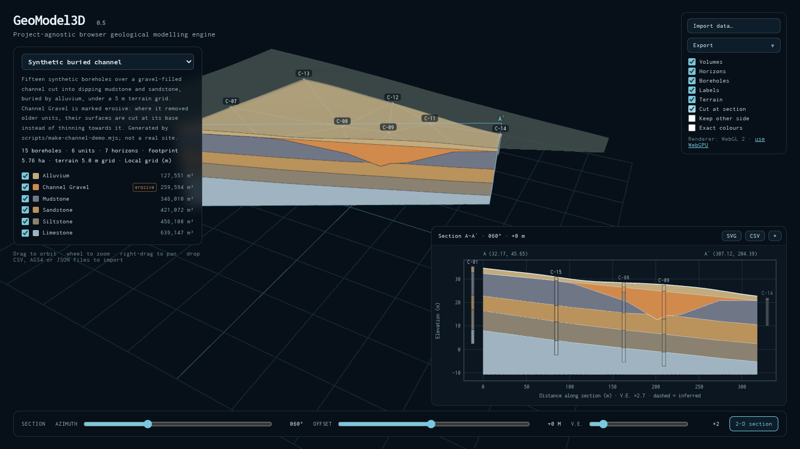

# GeoModel3D

**Project-agnostic, browser-native 3D geological modelling engine.**

GeoModel3D builds layer-cake geological models from borehole logs in the browser: TIN horizons, closed unit volumes and vertical sections, with no server and nothing to install.

- **Live:** https://kilickursat.github.io/GeoModel3D/
- **Offline:** [geomodel3d-offline.html](https://kilickursat.github.io/GeoModel3D/geomodel3d-offline.html) is a single self-contained file that opens from disk, for networks where hosted pages or local servers are not an option.



## Version 0.5

- **Terrain.** Import a terrain grid (ESRI ASCII `.asc` or gridded `.xyz`). The ground follows it, corrected so every surveyed collar keeps its elevation, and the present topography cuts the units below it.
- **Erosional units.** Mark a unit as erosive and its base cuts older units, as a buried channel does, instead of the older units thinning towards it.
- **Unit properties.** Unit weight, saturated unit weight and the source of the values, imported, exported and shown with each unit.
- **WebGPU-ready rendering.** The viewer runs on three.js's `WebGPURenderer` with TSL node materials; see [Rendering](#rendering).

Since 0.4:
- **Heterogeneous logs.** Units missing from a log pinch out. Holes that stop above deeper units are honoured without inventing contacts.
- **Data-driven projects.** The stratigraphic column (order, names, colours) comes from the data.
- **Import** CSV tables, AGS4, Georeport3D extraction JSON and GeoModel3D project JSON, by file picker or drag and drop. Every row that cannot be used is reported.
- **Sections** at any azimuth and offset:
  - a filled section in 3-D;
  - an optional cut-away of the model;
  - a 2-D section view, exportable as SVG or CSV.
- **Unit volumes** in m³, vertical exaggeration, unit visibility, borehole labels and hover details.
- **Three synthetic reference datasets** (valley, buried channel, layer-cake). They exercise the modelling kernel and are not real sites; their unit weights are illustrative and labelled as such.

## How a model is built

Boreholes → contacts → TIN horizons → closed unit volumes → sections

1. **Stratigraphic column.** Units are ordered youngest (top) to oldest (bottom). A project can declare the order. Otherwise it is inferred from the logs: if unit A lies directly above unit B in any hole, A comes first. Logs that disagree are reported.
2. **Reading a log.** Each borehole gives the elevation of every contact it shows. A unit missing between two logged units has zero thickness at that hole (it pinches out). A unit logged out of order below a younger one is modelled as the younger unit and reported. A contact inside an unlogged gap is placed at the middle of the gap and reported.
3. **Erosion.** If the unit directly above a contact is marked erosive, the units missing below it were eroded, not thinned. Their original surfaces at that hole are estimated from the holes that logged them, never below the erosion surface, and then cut by it.
4. **End of hole.** The base of the last unit a hole enters is not observed. Below it, horizons are inferred by stacking unit thicknesses, interpolated by inverse-distance weighting from holes that logged those units completely. The base of that last unit is kept below the end of the hole.
5. **Model base.** The lowest unit closes at a flat base at the deepest end of hole, or at the project's `base` elevation if one is given.
6. **Horizons.** All horizons share one Delaunay triangulation of the borehole collars, and the model covers the convex hull of the boreholes without extrapolating beyond it. Between holes, horizons are linear. With terrain or erosive units, the triangulation is subdivided so the ground can follow the terrain grid and erosion surfaces can cut sharply.
7. **Terrain.** The ground follows the terrain grid. The grid is corrected by the difference between each surveyed collar and the grid, interpolated between boreholes, so collars keep their surveyed elevations; collars more than 1 m off are reported. Every horizon is then kept at or below the ground, which removes units where the topography cuts below them.
8. **Volumes.** Each unit is a closed, outward-facing shell between its top and base horizons. Its volume is exact for this piecewise-linear model: triangle area × mean vertex thickness.
9. **Sections.** A vertical plane cuts every horizon along the same triangulation edges, so the unit polygons line up. Boreholes within a buffer are projected onto the section. A horizon segment is dashed unless it was logged at the boreholes around it.

## Importing data

Use **Import data…** or drop files on the page. Files are read in the browser and are not uploaded anywhere.

| Format | What is read |
|---|---|
| CSV, one table | One row per interval: hole id, x, y, z, from, to, unit, and optionally the final depth. |
| CSV, several tables | Collars (hole id, x, y, z, optional depth) and intervals (hole id, from, to, unit), plus an optional units table whose row order is the stratigraphic column: unit, name, colour, erosive (yes/no), unit weight, saturated unit weight (kN/m³) and source. |
| Terrain grid (`.asc`, `.xyz`) | An ESRI ASCII grid, or `x y z` points on a regular grid. It attaches to boreholes imported with it, or to the project already loaded. Grids above one million cells are averaged down. |
| AGS4 (`.ags`) | `LOCA`: `LOCA_NATE`/`LOCA_NATN`, with the local grid as a fallback, ground level `LOCA_GL` and final depth `LOCA_FDEP`. `GEOL`: `GEOL_TOP`/`GEOL_BASE`, with the unit from `GEOL_GEOL`, `GEOL_GEO2` or `GEOL_LEG`. Unit names come from `ABBR`. |
| Georeport3D extraction JSON | `collar` easting/northing/elevation, `total_depth`, and `intervals` (`depth_from`, `depth_to`, `lithology`). A borehole without a complete collar is reported and not placed; coordinates are never invented. |
| GeoModel3D project JSON | The format written by **Export → Project (JSON)**. |

CSV headers are matched case-insensitively against common names:
- **Hole id:** `Hole ID`, `BH`, `LOCA_ID`
- **x:** `Easting`, `x`
- **y:** `Northing`, `y`
- **z:** `Elevation`, `RL`, `Ground level`, `z`
- **From / to:** `Depth From`/`Top` and `Depth To`/`Base`
- **Unit:** `Unit`, `Formation`, `Lithology`

Comma, semicolon and tab delimiters are detected, and decimal commas are accepted in semicolon files. Coordinates must be in one projected coordinate system, in metres.

A minimal project file:

```json
{
  "format": "geomodel3d-project",
  "version": 1,
  "name": "My site",
  "crs": "EPSG:6677",
  "units": [
    {"id": "MG", "name": "Made ground", "color": "#7d6f86", "gamma": 19, "source": "Site investigation report, table 4"},
    {"id": "CG", "name": "Channel gravel", "color": "#d08a4c", "erosive": true},
    {"id": "MS", "name": "Mudstone", "color": "#6f7686", "gamma": 23, "gammaSat": 23.5}
  ],
  "boreholes": [
    {"id": "BH-01", "x": 456732.2, "y": 3987210.6, "z": 124.6, "depth": 35,
     "intervals": [{"from": 0, "to": 3.2, "unit": "MG"}, {"from": 3.2, "to": 30, "unit": "MS"}]}
  ],
  "terrain": {"x0": 456725, "y0": 3987205, "dx": 5, "dy": 5, "ncols": 3, "nrows": 2,
              "z": [124.1, 124.3, 124.8, 123.9, null, 124.5]}
}
```

Unit weights are in kN/m³ and optional; record where they come from in `source`. Terrain cells run west to east from the south-west cell centre (`x0`, `y0`); `null` marks a cell without data.

**Export** writes:
- **Project (JSON):** the format above.
- **Boreholes (CSV):** also usable as an import template.
- **Section (SVG):** a vector drawing.
- **Section (CSV):** distance, x, y and the elevation of every horizon along the section.

## Rendering

The viewer uses three.js's `WebGPURenderer` with TSL node materials, so one shader description serves both the WebGPU and the WebGL 2 backends.

- **WebGL 2 is the default backend.** The WebGPU backend has not yet been checked on real hardware, so it is opt-in: add `?backend=webgpu` to the address, or use the link under the display options. The toolbar shows which backend is running, and falls back to WebGL 2 where WebGPU is unavailable.
- **The cut-away is a shader mask**, so it behaves identically on both backends.
- **Frames are drawn only when something changes**, so an idle model costs nothing. This matters on machines without a graphics card.
- **Exact colours** shows units unlit in their legend colours, for reading colours rather than shapes.
- **Terrain beyond the model** is drawn translucent, so it never hides the model.

## Architecture

The modelling kernel has no rendering dependencies. It is tested in Node, and the viewer is a thin layer on top.

- `src/geology.ts` — project schema and the synthetic reference datasets
- `src/tin.ts` — Delaunay triangulation (Bowyer–Watson with a ghost vertex, so the convex hull is always covered)
- `src/terrain.ts` — terrain grids: reading, interpolation and coarsening
- `src/model.ts` — log interpretation, erosion, terrain and horizon assembly
- `src/volume.ts` — closed unit-volume meshes
- `src/section.ts` — vertical sections
- `src/sectionSvg.ts` — 2-D section drawing and CSV export
- `src/io.ts` — CSV, AGS4 and JSON import and export
- `src/main.ts` — Three.js viewer and interface
- `scripts/make-valley-demo.mjs`, `scripts/make-channel-demo.mjs` — generators for the synthetic datasets; the channel generator also writes the true geometry used in the tests
- `scripts/build-single.mjs` — offline single-file build

## Development

```sh
npm ci
npm test         # unit tests (vitest)
npm run build    # type-check, then build dist/ and dist/geomodel3d-offline.html
```

`npm run dev` starts Vite's development server. Where a local server cannot be used, build and open `dist/geomodel3d-offline.html` instead.

## Deployment

Every push to `main` runs the tests, builds the site and publishes `dist/` to GitHub Pages (`.github/workflows/build.yml`). The output is static: `dist/` can be served from any static host, and `dist/geomodel3d-offline.html` needs no host at all.

## Roadmap

Done:
- **0.4:** import adapters (CSV, AGS4, Georeport3D), missing units and pinch-outs, sections at any orientation with export.
- **0.5:** terrain, erosional units, unit properties, WebGPU-ready rendering.

Next:

1. **Appearance**, data-bearing only:
   - standard lithology symbols in 3-D and in the SVG section;
   - optional natural-looking rock textures;
   - terrain contours and hillshade;
   - fading where the model is inferred rather than logged.
2. **Physics fields** from the unit properties:
   - vertical stress, pore pressure and effective stress on volumes and sections;
   - a groundwater surface from water-level records;
   - horizontal stress only where K0 is given.
3. WebGPU as the default backend once checked on real hardware.
4. Reference models from real public site-investigation data (e.g. published AGS4 files).
5. Faults; constrained TIN boundaries, pinch-out lines and geological map contacts.
6. Fence diagrams for boreholes along an alignment (tunnels, roads).
7. GeoJSON, DXF and LAS import; GeoTIFF terrain.
8. Streaming and level of detail for large models.
9. Provenance display for Georeport3D extractions.

## License

Apache-2.0 — see [LICENSE](LICENSE).
